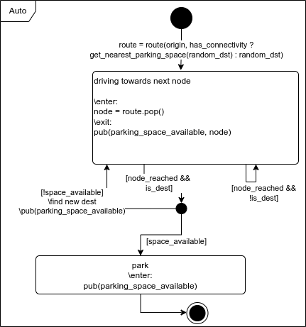
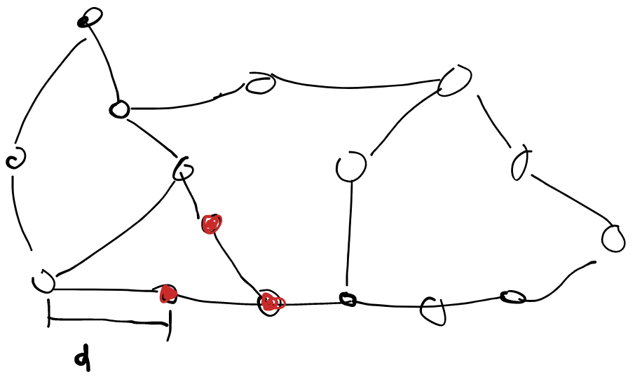

# Cyber-Physische Systeme

## Aufgabenblatt 1

### 1.2

1. Welche aktiven/passiven Komponenten gibt es im System?
	aktiv:
		- Parkplaetz-Sensorik 
		- Fahrzeug-Sensorik
			- Parkplatzerkennung
			- Fahrzeug-GPS
		- Reservierungsaktorik 
			- Blockade-Element
			- Lichtzeichengeber des Reservierungsstatus
	passiv:
		- Strassennetz
		- Parkplaetze (ohne Sensorik)
		- Autos (ohne Sensorik)
		- Stoerobjekte (auch Passanten)

2. Wieso besteht der Bedarf, die Komponenten miteinander zu vernetzen?
	- Parkplatz suchen nervig
	- Parkplatz suchen schmutzig
	- Parkplatz suchen Umwelt schlecht
	- Parkplatz suchen nicht planbar

3. Besteht fuer Systemkomponenten zur Laufzeit der Bedarf, sich an aeussere Einfluesse anzupassen und diese Anpassungen untereinander abzustimmen?
	Nein
	
	
	

### 1.3

min. 3 Anlagen / physische Elemente (+ Timed Automata):
	- Parkplatzsensorik
		- Parkplatz frei
		- Parkplatz besetzt
	

